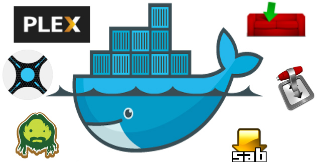

# ultimate-media-server
A collection of services that stands up all your media automation needs with Docker containers.

## What's in the box?!
*  [Sabnzbd](http://sabnzbd.org) (usenet download manager)
*  [Sickbeard](http://sickbeard.com) (tv search & download manager)
*  [Sonarr](https://sonarr.tv/) (tv search & download manager)
*  [CouchPotato](https://couchpota.to) (movie search & download manager)
*  [Transmission](https://transmissionbt.com) (torrent download manager)
*  [PlexPy](https://goo.gl/zHQveY) (Plex analytics)
*  [Plex Media Server (plexpass)](https://plex.tv) (tv & movie organizer and sharing)

## Getting Started

### Prequisites
* You're on a *nix machine (preferably Ubuntu)
  * [Install Docker following these steps](https://docs.docker.com/linux/step_one/)
  * Make sure docker-compose is installed via:
    * `apt-get install docker-compose`
* For the purposes of this guide...
  * All of your media is located at `./media`
  * Your temp directory is located at `./temp`
* This guide assumes you have a hosts file mapping `ultimate.media.server` to `127.0.0.1`.

### To setup
* `npm install`

### To start
* `PIA_USER=username PIA_PASS=password npm run docker`
  * Note that this will take a few minutes depending on your broadband speed on inital startup.
  * Every restart thereafter will be almost instant.
* Bonus: All containers will automatically restart after power outages

### To stop
* `npm run docker:stop`

### To restart (useful for quick auto-updating of apps)
* `npm run docker:restart`

Once the install finishes open your navigate to the following:

*  [http://ultimate.media.server:8080](http://ultimate.media.server:8080) // Sabnzbd
*  [http://ultimate.media.server:8081](http://ultimate.media.server:8081) // Sickbeard
*  [http://ultimate.media.server:8989](http://ultimate.media.server:8989) // Sonarr
*  [http://ultimate.media.server:5050](http://ultimate.media.server:5050) // CouchPotato
*  [http://ultimate.media.server:5051](http://ultimate.media.server:5051) // CouchPotato (for prereleases)
*  [http://ultimate.media.server:8091](http://ultimate.media.server:8091) // Transmission
*  [http://ultimate.media.server:8181](http://ultimate.media.server:8181) // PlexPy
*  [http://ultimate.media.server:32400/web](http://ultimate.media.server:32400/web) // Plex Media Server

### Want Transmission to run with authentication?
* Add the transmission username and password params and run the command below.
* `PIA_USER=username PIA_PASS=password TRANSMISSION_USER=tUsername TRANSMISSION_PASS=tPassword npm run docker`

### The &lt;insert service&gt; web app won't come up or isn't running

* This guide is only supported on *nix OSes. Try running on Ubuntu.
* Try restarting the services with `npm run docker:restart`

Special thanks to the maintainers of the following docker containers:
* [linuxserver/plex](https://hub.docker.com/r/linuxserver/plex)
* [linuxserver/plexpy](https://hub.docker.com/r/linuxserver/plexpy)
* [linuxserver/sonarr](https://hub.docker.com/r/linuxserver/sonarr)
* [linuxserver/sabnzbd](https://hub.docker.com/r/linuxserver/sabnzbd)
* [linuxserver/couchpotato](https://hub.docker.com/r/linuxserver/couchpotato)
* [timhaak/sickbeard](https://hub.docker.com/r/timhaak/sickbeard)
* [haugene/transmission-openvpn](https://hub.docker.com/r/haugene/transmission-openvpn)
* [nginx](https://hub.docker.com/_/nginx)
